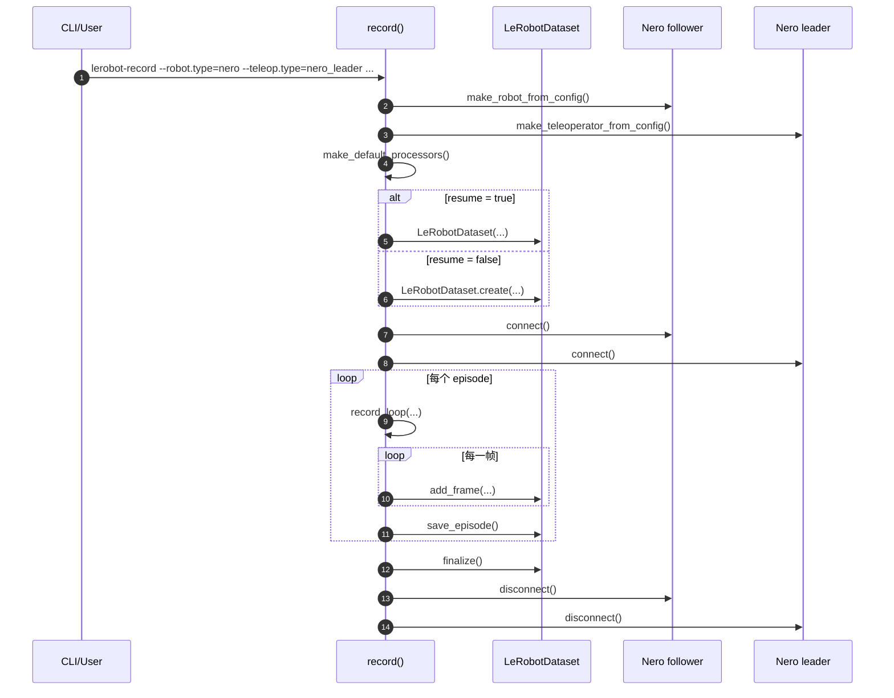
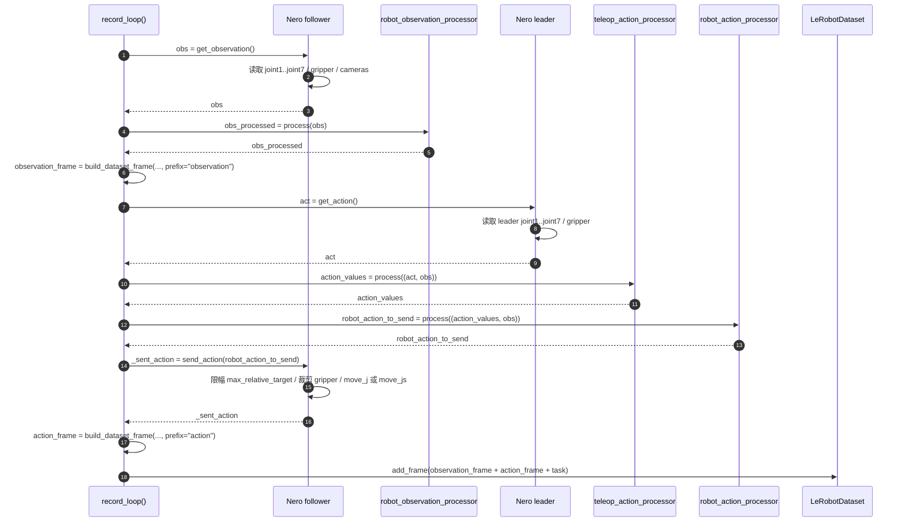

# NERO

本文结合当前代码实现，详细说明 LeRobot 中 NERO 机械臂遥操作的实际执行流程。重点不是泛泛介绍，而是回答下面几个问题：

- `lerobot-teleoperate` 启动后，哪些对象被创建？
- NERO leader 如何把自己的状态变成 teleop action？
- NERO follower 如何把 action 变成真实关节动作？
- 默认 processor 没有做任何坐标变换时，整条链路的语义到底是什么？

## 一句话结论

当前 NERO 遥操作默认是一条“关节空间直通”链路：

1. `nero_leader` 从 leader 机械臂读取 `joint1.pos` 到 `joint7.pos`，以及可选的 `gripper.pos`
2. 默认 `teleop_action_processor` 和 `robot_action_processor` 都是 identity，不改字段也不改数值
3. `nero` follower 直接把这些关节目标下发给 vendor SDK
4. 如果配置了 `max_relative_target`，follower 会在真正发送前做单步增量限幅

换句话说，默认配置下并没有 IK、末端位姿映射或坐标系转换，leader 和 follower 共享同一套关节动作语义。

## 相关代码文件

| 角色 | 代码位置 | 作用 |
| --- | --- | --- |
| 遥操作入口 | `src/lerobot/scripts/lerobot_teleoperate.py` | 解析配置、创建设备、运行主循环 |
| follower 基类 | `src/lerobot/robots/robot.py` | 约束 `connect / get_observation / send_action / disconnect` 接口 |
| NERO follower | `src/lerobot/robots/nero/nero.py` | 连接 NERO SDK、读取观测、发送关节和夹爪命令 |
| leader 基类 | `src/lerobot/teleoperators/teleoperator.py` | 约束 `connect / get_action / send_feedback / disconnect` 接口 |
| NERO leader | `src/lerobot/teleoperators/nero_leader/nero_leader.py` | 读取 leader 机械臂关节状态，输出 teleop action |
| 默认 processor | `src/lerobot/processor/factory.py` | 默认返回 identity pipeline |
| robot 工厂 | `src/lerobot/robots/utils.py` | `--robot.type=nero` 时实例化 `Nero` |
| teleop 工厂 | `src/lerobot/teleoperators/utils.py` | `--teleop.type=nero_leader` 时实例化 `NeroLeader` |

## 启动方式

一个最小可读的启动命令如下：

```bash
lerobot-teleoperate \
  --robot.type=nero \
  --robot.id=nero_follower \
  --robot.channel=can0 \
  --robot.effector=agx_gripper \
  --teleop.type=nero_leader \
  --teleop.id=nero_leader \
  --teleop.channel=can1 \
  --teleop.effector=agx_gripper \
  --fps=60 \
  --display_data=true
```

说明：

- `--robot.type=nero` 会走到 `make_robot_from_config()`，实例化 `Nero`
- `--teleop.type=nero_leader` 会走到 `make_teleoperator_from_config()`，实例化 `NeroLeader`
- `channel/interface/bitrate/timeout/start_read_thread` 等参数会原样传给 `pyAgxArm`
- 如果不需要夹爪，`effector` 保持默认 `none`

## 启动阶段

### 1. 解析配置并创建对象

`teleoperate(cfg)` 会先执行：

1. `teleop = make_teleoperator_from_config(cfg.teleop)`
2. `robot = make_robot_from_config(cfg.robot)`
3. `teleop_action_processor, robot_action_processor, robot_observation_processor = make_default_processors()`

这里有两个很关键的事实：

- `NeroLeaderConfig` 通过 `@TeleoperatorConfig.register_subclass("nero_leader")` 注册
- `NeroConfig` 通过 `@RobotConfig.register_subclass("nero")` 注册

因此 CLI 里的 `type` 字段能直接映射到对应类。

### 2. 默认 processor 是 identity

`make_default_processors()` 返回三个 pipeline，但每个 pipeline 内部都只有一个 `IdentityProcessorStep()`：

- `teleop_action_processor`: `(raw_action, obs) -> raw_action`
- `robot_action_processor`: `(teleop_action, obs) -> teleop_action`
- `robot_observation_processor`: `obs -> obs`

所以对 NERO 默认遥操作来说：

- leader 输出什么动作，follower 基本就收到什么动作
- follower 观测目前只给可视化和未来扩展 processor 使用
- `display_data=false` 时，观测仍然会在每轮开始时被读取一次

### 3. 连接顺序

`teleoperate(cfg)` 的连接顺序是：

1. `teleop.connect()`
2. `robot.connect()`
3. 进入 `teleop_loop(...)`

这个顺序意味着 leader 连不上时，follower 还不会开始连接。

## NERO leader 的连接流程

`NeroLeader.connect()` 做的事情基本是“把一台 NERO 机械臂接成输入设备”：

1. 检查 `pyAgxArm` 是否可用，不可用就直接抛 `ImportError`
2. 调用 `create_agx_arm_config(...)` 生成 vendor SDK 配置
3. 调用 `AgxArmFactory.create_arm(cfg)` 创建设备对象
4. 如果 `effector == "agx_gripper"`，初始化夹爪 end effector
5. `arm.connect(start_read_thread=...)`
6. `configure()`，当前只执行 `arm.set_normal_mode()`
7. `_wait_until_enabled()`，循环调用 `arm.enable()`，直到成功或超时
8. `_wait_for_joint_feedback()`，等待第一次有效关节反馈
9. `_wait_for_gripper_feedback()`，如果有夹爪则等待第一次有效夹爪反馈

leader 侧没有 LeRobot 自己的校准流程：

- `is_calibrated` 永远返回 `True`
- `calibrate()` 只是记录日志并跳过

## NERO follower 的连接流程

`Nero.connect()` 做的事情和 leader 类似，但多了摄像头和执行器配置：

1. 检查 `pyAgxArm`
2. 调用 `create_agx_arm_config(...)`
3. `AgxArmFactory.create_arm(cfg)`
4. 按需初始化 AGX gripper
5. `arm.connect(start_read_thread=...)`
6. 连接 `config.cameras` 里的所有相机
7. `configure()`
8. `_wait_until_enabled()`
9. `_wait_for_joint_feedback()`
10. 如果有夹爪，再 `_wait_for_gripper_feedback()`

`configure()` 的当前逻辑是：

- 总是执行 `self.arm.set_normal_mode()`
- 当 `joint_command_mode == "j"` 时，再执行：
  - `self.arm.set_motion_mode("j")`
  - `self.arm.set_speed_percent(self.config.speed_percent)`

这说明 follower 的运行模式主要由 `joint_command_mode` 和 `speed_percent` 控制。

## 主循环：每一帧到底发生了什么

主循环在 `teleop_loop(...)` 中。抽象成伪代码如下：

```python
while True:
    obs = robot.get_observation()
    raw_action = teleop.get_action()
    teleop_action = teleop_action_processor((raw_action, obs))
    robot_action_to_send = robot_action_processor((teleop_action, obs))
    robot.send_action(robot_action_to_send)
```

如果开启显示，还会把观测和动作送去 Rerun，同时在终端打印最终发送给 follower 的动作值。

### 1. follower 先读观测

`Nero.get_observation()` 的输出结构是：

- `joint1.pos` 到 `joint7.pos`
- 可选 `gripper.pos`
- 所有相机图像，例如 `front`

具体读取逻辑：

1. `self.arm.get_joint_angles()` 读取 7 个关节角
2. 如果有夹爪，调用 `self.end_effector.get_gripper_status()`
3. 遍历所有相机，执行 `cam.read_latest()`

几个实现细节很重要：

- 如果关节反馈暂时读不到，而历史缓存 `_last_joint_positions` 存在，则回退到“上一次有效值”
- follower 的观测包含相机，但动作接口不包含相机
- 当前默认 processor 不使用这些相机数据做控制，只在显示时使用

### 2. leader 再读动作

`NeroLeader.get_action()` 本质上是把 leader 当前状态打包成一个 `RobotAction`：

- `joint1.pos` 到 `joint7.pos`
- 可选 `gripper.pos`

实现上也是读取 SDK 反馈，而不是做任何插值或推理：

1. `self.arm.get_joint_angles()`
2. 如果有夹爪，`self.end_effector.get_gripper_status()`
3. 拼成 action 字典返回

因此 leader 在这里扮演的是“关节状态采样器”，而不是轨迹规划器。

### 3. processor 默认不改动作

虽然 `teleop_action_processor` 和 `robot_action_processor` 都拿到了 `(action, obs)`，但默认实现不会使用 `obs`，也不会修改 `action`。

所以默认情况下：

- `raw_action == teleop_action == robot_action_to_send`
- Nero 遥操作是“leader 关节角 -> follower 关节目标”的一对一透传

如果后续要做映射、缩放、镜像或坐标变换，应该在 processor 中实现，而不是改 `teleop_loop(...)`。

### 4. follower 执行动作

`Nero.send_action(action)` 会分成两部分处理：关节和夹爪。

#### 4.1 关节动作

只要 action 中出现任何一个 `joint{i}.pos`，就会进入关节下发逻辑：

1. 先读取当前关节角，得到 `current_positions`
2. 用 action 中提供的值覆盖对应关节，未提供的关节保持当前位置
3. 如果配置了 `max_relative_target`，调用 `ensure_safe_goal_position(...)` 做单步增量限幅
4. 按关节顺序拼成 `target_list`
5. 根据 `joint_command_mode` 选择：
   - `"js"`: `self.arm.move_js(target_list)`
   - 其他情况: `self.arm.move_j(target_list)`
6. 更新 `_last_joint_positions`
7. 把实际下发的目标打包成 `sent_action`

这里有两个设计点需要特别注意：

- follower 支持“部分关节动作”，缺失关节会自动回填成当前值
- 安全限幅发生在 follower 侧，而不是 leader 侧

#### 4.2 夹爪动作

如果配置了 `agx_gripper` 且 action 中包含 `gripper.pos`：

1. 先把宽度裁剪到 `[0.0, 0.1]` 米
2. 调用 `self.end_effector.move_gripper(width=width, force=self.config.gripper_force)`
3. 把实际宽度记录到 `_last_gripper_width`
4. 写入 `sent_action["gripper.pos"]`

这意味着 leader 即使给出超过物理范围的夹爪目标，follower 最终也只会发送合法宽度。

## 默认动作语义

在当前实现里，NERO leader 和 follower 共享完全一致的动作字段：

| 字段 | 含义 |
| --- | --- |
| `joint1.pos` | 第 1 关节目标位置 |
| `joint2.pos` | 第 2 关节目标位置 |
| `joint3.pos` | 第 3 关节目标位置 |
| `joint4.pos` | 第 4 关节目标位置 |
| `joint5.pos` | 第 5 关节目标位置 |
| `joint6.pos` | 第 6 关节目标位置 |
| `joint7.pos` | 第 7 关节目标位置 |
| `gripper.pos` | 夹爪开口宽度，仅在 `effector=agx_gripper` 时存在 |

因此默认遥操作可以理解成：

- leader 读出一帧“当前关节姿态”
- follower 把这帧姿态当成“目标关节姿态”

只要两台机械臂的关节定义、零位和运动学语义一致，这条链路就是直接成立的。

## 安全与鲁棒性

### 1. 单步目标限幅

`NeroConfig.max_relative_target` 可以限制单帧目标变化量。它支持：

- 一个浮点数：对所有关节使用同一个上限
- 一个字典：为每个关节配置不同上限

限幅逻辑位于 `ensure_safe_goal_position(...)`，核心思想是：

- 用 `goal_pos - present_pos` 计算单步目标差值
- 把差值裁到 `[-max_diff, max_diff]`
- 生成安全目标 `safe_goal_pos`

这能避免 leader 大幅跳变时 follower 直接冲向远端目标。

### 2. 反馈缺失时的退化策略

关节反馈读取失败时：

- 如果已有历史值，则回退到 `_last_joint_positions`
- 如果连历史值都没有，直接报错

夹爪反馈略有不同：

- leader 和 follower 在运行中如果读夹爪状态失败，会回退到 `_last_gripper_width`
- 连接阶段如果一直读不到有效夹爪反馈，则会超时失败

### 3. 超时保护

以下环节都有 `timeout` 保护：

- 等待 `arm.enable()`
- 等待首帧关节反馈
- 等待首帧夹爪反馈

### 4. 断开连接

无论是正常退出还是 `KeyboardInterrupt`，`teleoperate(cfg)` 的 `finally` 都会执行：

1. `teleop.disconnect()`
2. `robot.disconnect()`

断开时的行为包括：

- 可选 `disable_gripper_on_disconnect`
- follower 还会断开所有相机

### 5. 可选的时间戳偏差监控

`NeroConfig` 还支持一组可选配置，用来监控 `joints.timestamp` 和每路 `<camera_name>.timestamp` 的偏差：

- `observation_timestamp_skew_error_s`: 偏差超过多少秒后打印 `error` 日志；默认 `None`，表示关闭
- `observation_timestamp_skew_error_interval_s`: 同一路相机在持续异常时，`error` 日志的最小打印间隔；默认 `5.0`

这只是运行时诊断，不会中断 `get_observation()`，也不会改变 observation 内容。

## 为什么说这条链路是“关节空间镜像”而不是“位姿遥操作”

很多遥操作系统会做下面这些事情：

- 读取 leader 末端位姿
- 做坐标系对齐或尺度缩放
- 求 IK
- 再把关节目标发给 follower

当前 NERO 代码没有这层变换。理由很直接：

- leader 输出字段就是 `joint{i}.pos`
- 默认 processor 是 identity
- follower 接收字段仍然是 `joint{i}.pos`

因此这不是“末端空间控制再映射到关节”，而是“leader 当前关节状态直接驱动 follower 目标关节状态”。

如果后续想做真正的末端位姿遥操作，有两个合理入口：

1. 扩展 `NeroLeader.get_action()`，让它输出末端位姿类 action
2. 保持 leader/follower 不变，在 processor 中加入 FK/IK、坐标变换和安全限制

第二种方式更符合 LeRobot 当前 processor 架构。

## NERO 数据采集时序

上面讲的是 `lerobot-teleoperate` 的实时遥操作流程。真正把 NERO 遥操作数据保存成数据集时，走的是 `lerobot-record`，入口在 `src/lerobot/scripts/lerobot_record.py`。

它和 `teleoperate` 的最大区别是：

- 每一帧除了控制机器人，还会调用 `dataset.add_frame(...)` 把观测和动作写入当前 episode buffer
- 每个 episode 结束后会调用 `dataset.save_episode()`，把数据真正落盘到 `meta/`、`data/`、`videos/`

### Episode 级时序图



这张图对应 `record()` 的主流程：

- 创建 robot / teleop / dataset
- 连接两台 NERO
- 反复调用 `record_loop(...)`
- 每个 episode 结束后执行 `dataset.save_episode()`

### 单帧录制时序图



这张图反映的是 `record_loop(...)` 每一帧的实际顺序：

1. 先从 NERO follower 读取观测
2. 再从 NERO leader 读取关节动作
3. 用默认 identity processor 保持动作不变
4. 发送动作给 follower 执行
5. 把观测帧和动作帧一起加入 dataset buffer

### 录制时真正保存了什么

结合 `Nero.observation_features`、`Nero.action_features` 和默认 processor，NERO 数据集默认会保存：

- `observation.state`: `joint1.pos` 到 `joint7.pos`、可选 `gripper.pos`、`joints.timestamp`，以及每路相机的 `<camera_name>.timestamp`
- `observation.images.<camera_name>`: follower 上配置的所有相机
- `action`: leader 侧读到的 `joint1.pos` 到 `joint7.pos`，以及可选 `gripper.pos`

### 一个容易忽略的细节

当前 `record_loop(...)` 里写入数据集的是 `action_values`，不是 `robot.send_action(...)` 返回的 `_sent_action`。

这意味着如果 follower 在执行时做了：

- `max_relative_target` 单步限幅
- `gripper.pos` 的 `[0.0, 0.1]` 裁剪

那么数据集中的 action 可能和“真实发送到硬件的最终动作”不完全一致。

## 总结

当前 LeRobot 中的 NERO 遥操作流程可以浓缩成一句话：

> `lerobot-teleoperate` 每一帧先读取 NERO follower 观测，再读取 NERO leader 的关节状态，默认不经过任何映射处理，最后由 NERO follower 在执行前做必要的安全裁剪并下发到 vendor SDK。

所以如果你在调试 NERO 遥操作，优先检查的不是复杂算法，而是这四件事：

1. leader 和 follower 是否都成功连接并拿到首帧反馈
2. 两边的关节定义和零位是否一致
3. `max_relative_target` 是否把动作截得过紧
4. `joint_command_mode`、`speed_percent`、`effector` 是否符合你的硬件预期
